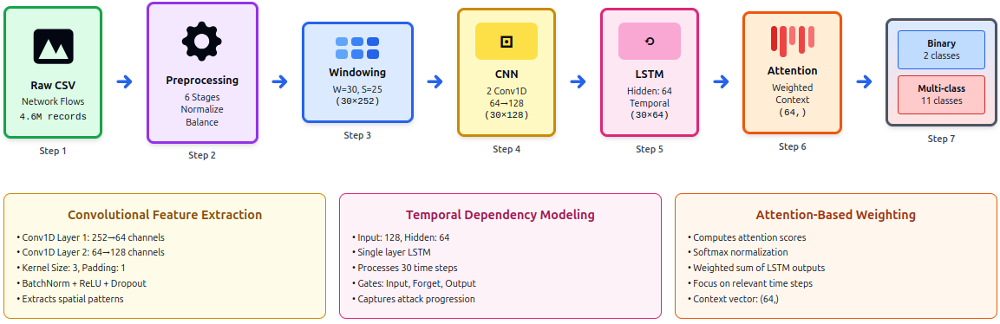
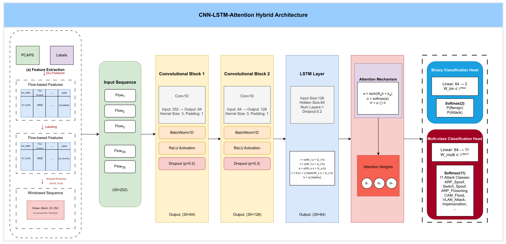
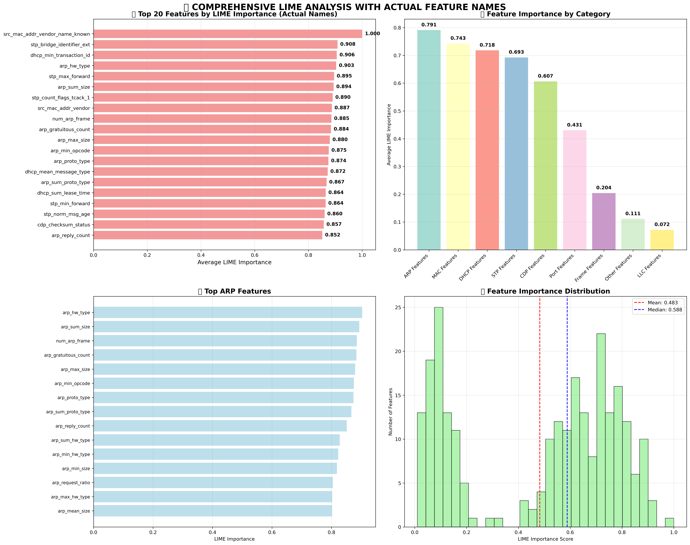

---

# Model Architecture

The proposed model employs a **CNN-LSTM-Attention Hybrid Architecture** designed specifically for real-time Data Link Layer intrusion detection. It addresses the challenge of identifying advanced Layer 2 attacks by modeling both spatial features (individual flow characteristics) and temporal dependencies (patterns across time).

### High-Level Design
The architecture combines three deep learning paradigms:
1.  **CNN (Convolutional Neural Networks):** For spatial feature extraction from individual flows.
2.  **LSTM (Long Short-Term Memory):** For capturing temporal dependencies across a sequence of flows.
3.  **Attention Mechanism:** For adaptive feature importance weighting, allowing the model to focus on specific time steps in the window.

*Figure 1: The overall structure of the CNN-LSTM-Attention Hybrid model.*

### Detailed Layer Structure
The model processes a sliding window of network flows. The input passes through stacked Conv1D layers, followed by an LSTM network, and finally an Attention layer that aggregates the context before splitting into a dual-head output (Binary and Multi-class).

*Figure 2: Detailed architecture showing layer dimensions and flow.*

---

# Training & Loss Function

To effectively train the model on imbalanced network traffic data, we utilize a **Multi-Task Loss Function**. This approach combines binary classification (Normal vs. Attack) with multi-class classification (Specific Attack Type) to ensure the model learns both general anomalies and specific attack signatures.

### Optimization Strategy
* **Optimizer:** AdamW with decoupled weight decay.
* **Scheduler:** Cosine Annealing with warm restarts.
* **Loss weighting:** We balance the two tasks using a hyperparameter $\alpha$ (set to 0.3).

### Loss Calculation
The total loss $\mathcal{L}_{\text{total}}$ is calculated as:

$$
\mathcal{L}_{\text{total}} = \alpha \mathcal{L}_{\text{binary}} + (1-\alpha) \mathcal{L}_{\text{multi}}
$$

#### 1. Binary Loss
Standard Cross-Entropy is used for the binary head to distinguish between Benign and Malicious traffic:

$$
\mathcal{L}_{\text{binary}} = -\frac{1}{N}\sum_{i=1}^{N}\left[y_i^{\text{bin}} \log(\hat{y}_i^{\text{bin}}) + (1-y_i^{\text{bin}})\log(1-\hat{y}_i^{\text{bin}})\right]
$$

#### 2. Multi-Class Loss (Weighted)
To handle the class imbalance inherent in intrusion detection datasets, we use Weighted Cross-Entropy for the multi-class head. The weights ensure minority attack classes contribute proportionally to the gradient:

$$
\mathcal{L}_{\text{multi}} = -\frac{1}{N}\sum_{i=1}^{N} w_{c_i} \sum_{k=1}^{11} y_{ik} \log(\hat{y}_{ik})
$$

Where the class weight $w_k$ is computed using a balanced strategy:

$$
w_k = \frac{N}{11 \cdot N_k}
$$

---

# Experimental Results

This section evaluates the model using data processed by the **[DLLFlowLyzer](https://github.com/ahlashkari/DLLFlowlyzer)** framework. We benchmarked the model against traditional machine learning classifiers and single-architecture deep learning models.

### Overall Performance
The model achieves exceptional performance on the held-out test set, significantly outperforming standard benchmarks.

| Metric | Weighted Average (%) | Standard Deviation (%) |
| :--- | :--- | :--- |
| Precision | 99.73 | 0.18 |
| Recall | 99.65 | 0.21 |
| **F1-Score** | **99.67** | **0.15** |
| Accuracy | 99.66 | 0.12 |

### Per-Class Breakdown
The model remains robust across all attack types, with no class falling below 99.5% F1-score.

| Attack Class | Precision (%) | Recall (%) | F1-Score (%) |
| :--- | :--- | :--- | :--- |
| **Benign** | 99.82 | 99.71 | 99.76 |
| **ARP_Spoof** | 99.68 | 99.64 | 99.66 |
| **Switch_Spoof** | 99.71 | 99.52 | 99.61 |
| **ARP_Poisoning** | 99.75 | 99.88 | 99.81 |
| **Impersonation** | 99.66 | 99.64 | 99.65 |
| **CAM_Flood** | 99.79 | 99.76 | 99.77 |
| **VLAN_Attack** | 99.58 | 99.52 | 99.55 |
| **CDP_Attack** | 99.81 | 99.76 | 99.78 |
| **DHCP_Spoof** | 99.64 | 99.40 | 99.52 |
| **DHCP_Starv** | 99.70 | 99.64 | 99.67 |
| **STP_Attack** | 99.77 | 99.88 | 99.82 |
| **Weighted Avg** | **99.73** | **99.65** | **99.67** |

### Baseline Comparison
Our proposed Hybrid approach demonstrates substantial superiority over both traditional Machine Learning and single-architecture Deep Learning methods.

| Method | Precision (%) | Recall (%) | F1-Score (%) |
| :--- | :--- | :--- | :--- |
| Random Forest | 87.34 | 85.92 | 86.62 |
| XGBoost | 89.67 | 88.45 | 89.05 |
| SVM (RBF kernel) | 83.21 | 81.76 | 82.47 |
| MLP (3 layers) | 91.45 | 90.12 | 90.78 |
| CNN only | 93.67 | 92.34 | 93.00 |
| LSTM only | 93.12 | 93.56 | 93.84 |
| **Proposed** | **99.73** | **99.65** | **99.67** |

### Ablation Study
Ablation testing confirms that **Temporal Windowing** and the **LSTM Layer** are the most critical contributors to performance.

| Configuration | F1-Score (%) | $\Delta$ F1 (%) |
| :--- | :--- | :--- |
| **Full Model (Proposed)** | **99.67** | **0.00** |
| Without LSTM Layer | 94.23 | -5.44 |
| Without Attention Mechanism | 97.12 | -2.55 |
| Without Dual Heads | 98.89 | -0.78 |
| Without Temporal Windows | 91.56 | -8.11 |

## 4. Explainability Analysis
We utilized SHAP (global importance) and LIME (local approximations) to interpret model decisions.

### SHAP Feature Importance
The analysis confirms the model relies on protocol-specific features rather than statistical artifacts.

| Attack Class | Top 5 Most Important Features |
| :--- | :--- |
| **ARP_Spoof** | `arp_request_ratio`, `arp_gratuitous_count`, `src_mac_lg`, `arp_reply_ratio`, `mac_vendor_known` |
| **Switch_Spoof** | `dtp_version`, `dtp_sender_id`, `isl_vlan_id`, `dtp_frame_isl_ratio`, `vlan_native_vlan` |
| **ARP_Poisoning** | `arp_gratuitous_count`, `arp_request_ratio`, `arp_opcode_mean`, `src_mac_vendor`, `dst_mac_vendor` |
| **Impersonation** | `src_mac_vendor_known`, `dst_mac_device`, `src_mac_lg`, `mac_vendor_mismatch`, `frame_delta_time` |
| **CAM_Flood** | `src_mac_diversity`, `frame_rate`, `unique_mac_count`, `mac_ig_bit`, `burst_ratio` |
| **VLAN_Attack** | `vlan_id_double_tag`, `isl_vlan_id`, `dtp_trunk_status`, `eth_type`, `vlan_priority` |
| **CDP_Attack** | `cdp_addresses_count`, `cdp_capabilities_sum`, `cdp_ttl`, `cdp_power_sum`, `cdp_version` |
| **DHCP_Spoof** | `dhcp_message_type`, `dhcp_options_count`, `dhcp_server_id`, `src_ip_addr`, `dhcp_lease_time` |
| **DHCP_Starv** | `dhcp_transaction_id_diversity`, `dhcp_request_rate`, `src_mac_diversity`, `dhcp_discover_count` |
| **STP_Attack** | `stp_msg_age`, `stp_topology_change`, `stp_bridge_priority`, `stp_root_cost`, `stp_forward_delay` |

### LIME Summary

*Figure: LIME analysis showing the balance between protocol-specific categories (ARP, DHCP, STP) and statistical properties (Rates, Diversity).*